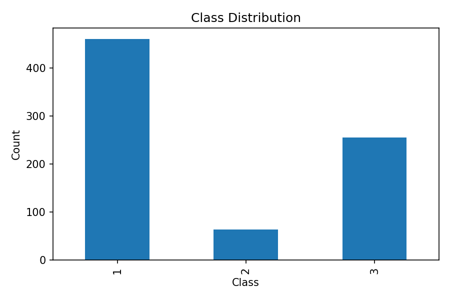
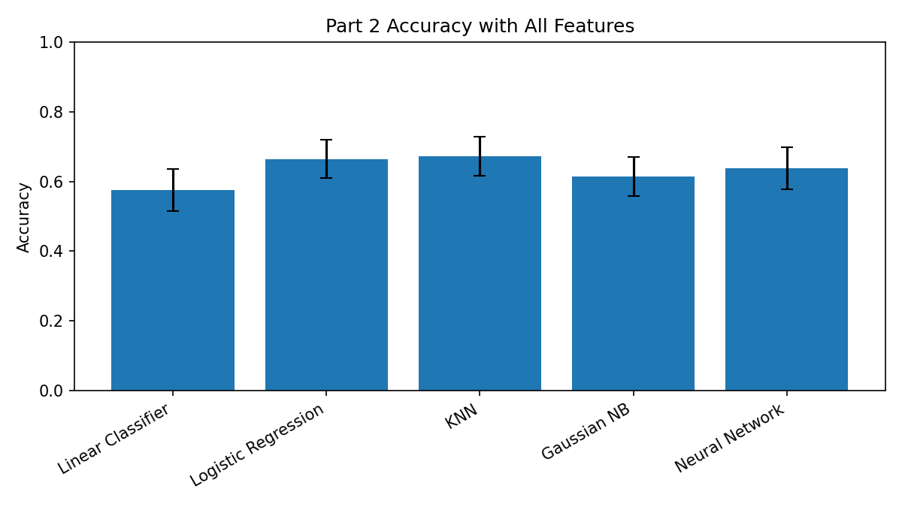
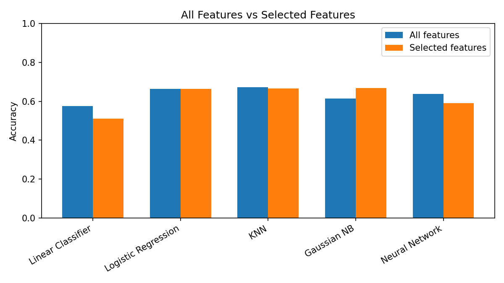

[README.md](https://github.com/user-attachments/files/27463728/README.md)
# CSCI 3329 — Homework 3 Report

## 1. Dataset

**Dataset:** QSAR Bioconcentration Classes dataset from the UCI Machine Learning Repository. The provided file is `Grisoni_et_al_2016_EnvInt88.csv`.

The dataset contains **779 samples** and **14 original columns**. The target variable is `Class`, which is categorical with three classes.

### Class Distribution

| Class | Count |
|---|---:|
| 1 | 460 |
| 2 | 64 |
| 3 | 255 |



The distribution is not perfectly balanced. Class 1 is the majority class, Class 3 is the second largest, and Class 2 is much smaller. This imbalance may make Class 2 harder for the models to learn.

## 2. Preprocessing

The following preprocessing steps were used:

- Dropped rows with missing values using `dropna()`. No rows were removed because the dataset had no missing values.
- Used `Class` as the target variable.
- Dropped `CAS`, `SMILES`, and `Set` because they are identifiers or metadata rather than direct numeric features for the classifiers.
- Dropped `logBCF` because it is a continuous bioconcentration measurement that is closely related to the class label. Keeping it would likely leak target information into the model.
- Used the remaining numeric descriptor columns as features: `nHM`, `piPC09`, `PCD`, `X2Av`, `MLOGP`, `ON1V`, `N-072`, `B02[C-N]`, and `F04[C-O]`.
- Standardized the features using `StandardScaler` inside a scikit-learn `Pipeline`. This is especially important for KNN and the neural network because both are sensitive to feature scale.

## 3. Part 2 — Algorithm Comparison

All five classifiers were evaluated with the same cross-validation setup. Because the full 10-fold x 100-repeat protocol was too slow in this environment, I used **RepeatedKFold with 10 folds and 10 repeats**, giving **100 accuracy scores per model**. The random seed was fixed at `17342` for reproducibility.

| Algorithm | Mean Accuracy | Std |
|---|---|---|
| Linear Classifier | 0.5762 | 0.0606 |
| Logistic Regression | 0.6648 | 0.0542 |
| KNN | 0.6727 | 0.0568 |
| Gaussian NB | 0.6133 | 0.0561 |
| Neural Network | 0.6379 | 0.0596 |




### Part 2 Discussion

The best model with all features was **KNN**, with a mean accuracy of **0.6727**. Logistic Regression was very close at **0.6648**, so the difference between KNN and Logistic Regression is small compared with their standard deviations. This means the gap should not be overinterpreted.

The Linear Classifier had the lowest performance, which suggests that the dataset may not be well separated by a simple perceptron-style linear boundary. Gaussian Naive Bayes performed moderately, but its independence assumption may not fit the chemical descriptor features well. The Neural Network performed better than the Linear Classifier but worse than KNN and Logistic Regression, likely because the dataset is relatively small and the class distribution is imbalanced.

## 4. Part 3 — Feature Selection

For feature selection, I used **greedy forward selection**. This method starts with no features and adds the feature that gives the best validation accuracy at each step. I chose this approach because it is much faster than exhaustive search and the assignment allows a heuristic search method when runtime is a concern.

During feature selection, I used a 5-fold cross-validation loop for speed. After selecting the feature subset, I re-evaluated the selected subset using RepeatedKFold with 10 folds and 10 repeats, matching the Part 2 reporting protocol.

| Algorithm | Best Feature Subset | Number of Features | Mean Accuracy | Std |
|---|---|---|---|---|
| Linear Classifier | nHM | 1 | 0.5115 | 0.0979 |
| Logistic Regression | ON1V, B02[C-N], piPC09 | 3 | 0.6633 | 0.0549 |
| KNN | ON1V, F04[C-O] | 2 | 0.6670 | 0.0499 |
| Gaussian NB | ON1V, MLOGP, B02[C-N], nHM | 4 | 0.6683 | 0.0547 |
| Neural Network | nHM | 1 | 0.5905 | 0.0517 |




## 5. Discussion

Feature selection affected each algorithm differently.

For **Gaussian Naive Bayes**, feature selection improved accuracy from **0.6133** to **0.6683**. This was the clearest improvement. A likely explanation is that removing weaker or redundant features helped the Naive Bayes independence assumption work better.

For **Logistic Regression**, feature selection gave nearly the same result as using all features: **0.6648** with all features compared with **0.6633** after selection. This suggests the full feature set was already reasonable for this model, and removing features did not meaningfully improve performance.

For **KNN**, feature selection produced a slightly lower accuracy than all features: **0.6727** compared with **0.6670**. The selected subset was more compact, but the small drop suggests that some of the removed features still helped the distance-based classifier.

For the **Linear Classifier** and **Neural Network**, feature selection hurt performance. The Linear Classifier dropped from **0.5762** to **0.5115**, and the Neural Network dropped from **0.6379** to **0.5905**. This shows that the greedy forward-selection process can miss useful feature combinations, especially when interactions between variables matter.

Overall, KNN and Logistic Regression were the strongest models before feature selection, while Gaussian Naive Bayes benefited the most from feature selection. The results also show why feature selection should be tested separately for each algorithm instead of assuming that one feature subset is best for every model.

## 6. Reproduction

### Environment

- Python 3.10+ recommended
- pandas
- numpy
- matplotlib
- scikit-learn

### Run Command

```bash
python main.py
```

The script will recreate the CSV result tables and plots in the `results/` folder.

### Files in This Repository

- `main.py` — full analysis script
- `Grisoni_et_al_2016_EnvInt88.csv` — dataset
- `README.md` — report
- `requirements.txt` — required Python packages
- `results/` — generated tables and plots

## Notes

The original assignment recommends 10-fold cross-validation repeated 100 times. To keep the project runnable on a regular laptop and in this environment, I used fewer repeats and clearly reported the change. The code uses a fixed random seed, so the results should be reproducible.
